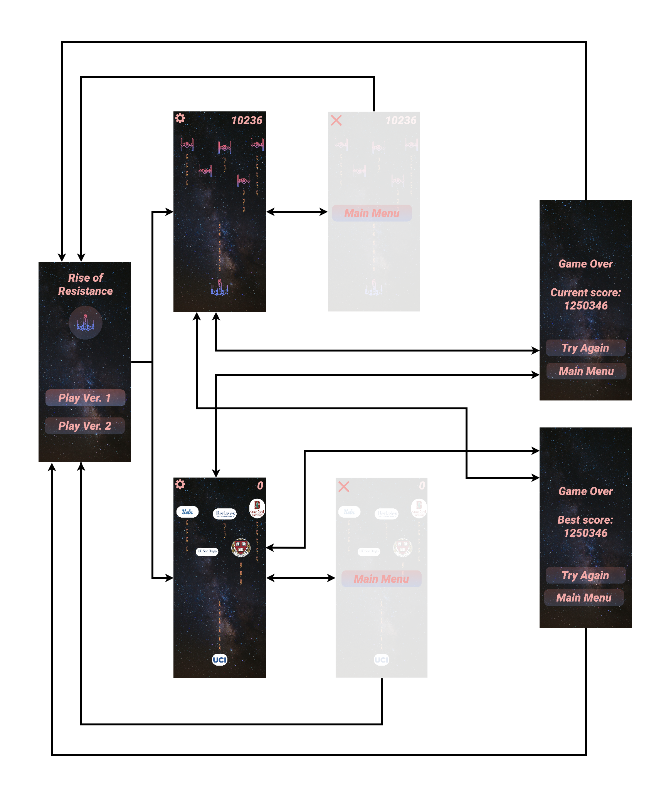
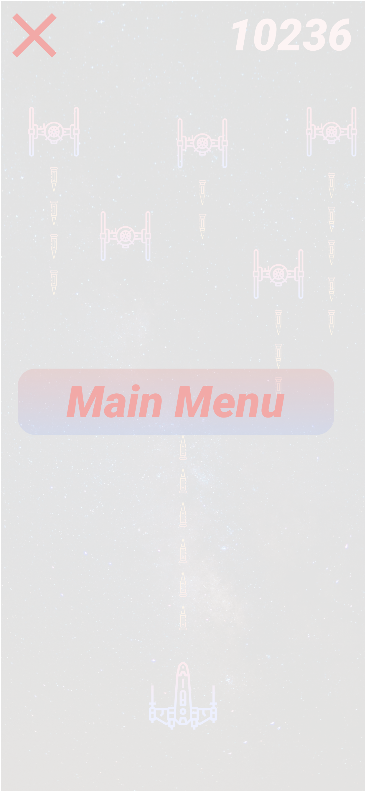
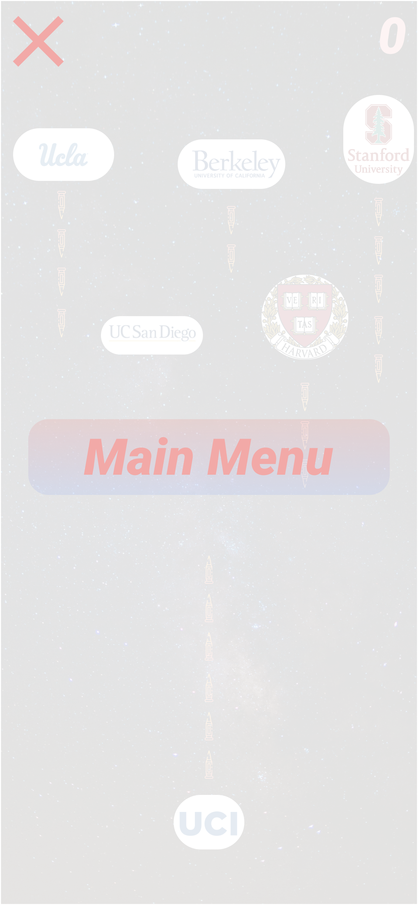

# Rise of Resistance

# (Please remove this line when finished) README Example: https://hackmd.io/MTD5HxGBRtSdcEJ08kT63w?both

## Table of Contents

1. [Overview](#Overview)
1. [Product Spec](#Product-Spec)
1. [Wireframes](#Wireframes)
1. [Schema](#Schema)

## Overview

### Description

Rise of Resistance is an iOS game that is based on a classic battleship shooting game. It is fun game with aim to rack up the highest points possible. It also has multiple version where you could play as a regular battleship, or a secondary version which also the player to play as a UCI mascot and take down other institutions.

### App Evaluation

- **Category:** Gamming/Games
- **Mobile:** This is a mobile game and would be available on mobile devices to be played.
- **Story:** Destroy all of the resistance and gain the highest best score, by shooting down enemies and dodging fire.
- **Market:** An individual would use this application to destress and have fun. It can be downloaded and played by people of all age groups.
- **Habit:** This app could be used as often or unoften as the user want. It depends on how bored the user is and how often they use thier phone for gaming.
- **Scope:** We start of with being able to just shoot down enimies, but later we could evolve into having different powerups and different skins for your own spaceship. 

## Product Spec

### 1. User Stories (Required and Optional)

**Required Must-have Stories**

- User can choose the game mode on the home screen (Version 1 or Version 2)
- User can start a game
- User can shoot down enemy ships
- User can move from side to side to dodge fire
- User can gain points
- User can lose the game
- User can get a current score and best score
- User can play again
- User can go back to the main menu
- User can pause the game

**Optional Nice-to-have Stories**

- User can play as UCI in Version 2 and shoot down other schools
- User can choose between different skins
- User can gain different powerups

### 2. Screen Archetypes

- Main Menu
  - User can choose the game mode
  - User can start a game
- Game Version 1
  - User can shoot down enemy ships
  - User can move from side to side to dodge fire
  - User can gain points
  - User can lose the game
  - User can pause the game
- Game Version 2
  - User can shoot down enemy schools
  - User can move from side to side to dodge fire
  - User can gain points
  - User can lose the game
  - User can pause the game
- Paused
  - User can go back to the main menu
- Game Over
  - User can get a current score and best score
  - User can play again
  - User can go back to the main menu

### 3. Navigation

**Tab Navigation** (Tab to Screen)

- Pause a game
- Unpause a game

**Flow Navigation** (Screen to Screen)

- Main Menu
	- Version 1
	- Version 2
- Game Version
	- Pause
	- Game Over
- Game Version 2
	- Pause
	- Game Over
- Paused
	- Main Menu
	- Game Version 1 or Version 2 (Unpause)
- Game Over
	- Game Version 1 or Version 2 (Restart)
	- Main Menu

## Wireframes

[Add picture of your hand sketched wireframes in this section]

### [BONUS] Digital Wireframes & Mockups

   
   
   
   
   
   
   

### [BONUS] Interactive Prototype

## Schema

[This section will be completed in Unit 9]

### Models

[Add table of models]

### Networking

- [Add list of network requests by screen ]
- [Create basic snippets for each Parse network request]
- [OPTIONAL: List endpoints if using existing API such as Yelp]
